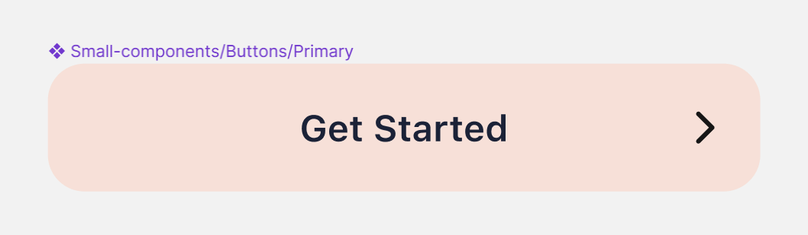
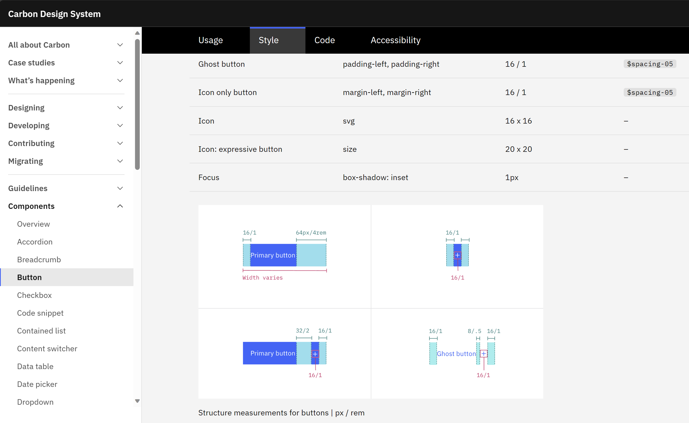
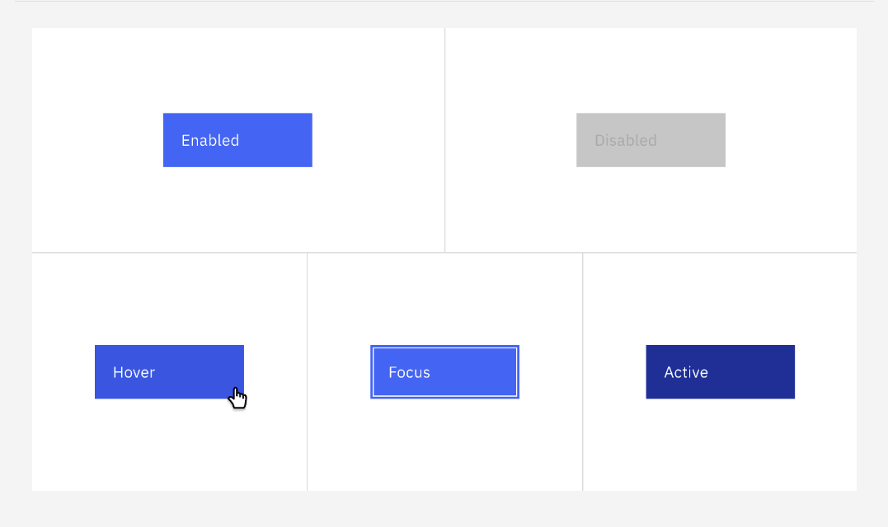

Throughout my years as a developer, I've worked on various projects, ranging from my side projects to projects for startups, small companies, and even large enterprises.

The common thread among all these projects is that, whether it's a small organization or a large enterprise, every application needs... a button.

Of course, there are many other UI components needed to make a complete application.

I'm using a button as an example because it's a small UI element, but it turns out there's a lot to talk about around it, making it an interesting subject.

So today, I'll share with you the differences in making a button in an enterprise application compared to a small organization and what we can learn through this process.

## 1. Enterprise Demands More Detail.

One thing I've noticed is that in a small organization or a small project, there's often not enough resources invested in systematically designing UI/UX.

This doesn't mean their UI is simple. The projects I've worked on have had beautiful and complex UI. However, they usually have only one or two designers working on UI, and they barely have time to design the screens in a static state.

For example, the buttons in their design often have only one state. Other states like `hover`, `active`, `disable`, `focus` are not considered.



In contrast, in enterprises, they have a large design team. In one project I worked on, they even had a designer dedicated to creating animations for UI components.

They also often have their own design system to ensure consistency across all UI components in the application.

Some well-known design systems include Google's Material Design, Alibaba's Ant Design, IBM's Carbon Design, Microsoft's Fluent. But these are just a small part; most large companies have their own design systems that are not publicly disclosed.

So, when describing the UI for a button, they have several documentation pages detailing each state of the button, from color, size, padding, margin, to animation, and different types of buttons for different use cases. Parameters and colors also have to follow a naming system of the design system rather than any arbitrary value.



In summary, making a button in an enterprise requires much more detailed specifications compared to making one in a small organization.

Of course, in many large companies, they have a small team dedicated to coding basic UI components following the design system and providing them to other teams.

But in many cases, teams still have to code some components because the number of UI components is too large and constantly changing. For example, even Google's Material Design has some components not available in their Flutter library, despite having a vibrant open-source community contributing to it.

I've also worked on some UI components for an enterprise project, and I found that making a button is not simple at all. After coding, the QA team thoroughly checks whether it adheres to the design system, so I had to be meticulous and not overlook any small details.

## 2. Must be Reusable and Maintainable.

In a small organization, the code I write is often specific to a particular project. Going from one project to another means dealing with entirely different UI.

The number of developers reusing my code is also minimal because the team is relatively small. If customization is needed, they simply edit the code, and it doesn't affect too many people. Team members just need to notify each other.

But in an enterprise, due to adhering to the design system, different projects still use the same UI style.

The number of developers reusing my code is much larger. Editing the code requires more caution because it affects many people. Communicating information to everyone is not a simple task.

Therefore, even making a button in an enterprise requires ensuring that it is easy to reuse and maintain.

So, making a button in an enterprise is not just about coding; it also involves designing an API for it, writing documentation, and ensuring that the code is easy to understand and modify later.

## 3. Applying Widely Known Patterns and Example of MaterialStateProperty.

The most standard way to write code that is easy to understand and maintain is to apply widely known patterns in the industry.

A pattern is a solution to a common problem that has been formulated and proven effective by many people.

In simple terms, if you code in a popular way, there's a high chance that others have read about or at least can easily search for information on how to do it, leading them to understand and modify your code easily.

I have a specific case to illustrate this for you. It's when I needed to create a button following IBM's Carbon Design in a Flutter project.

Many of you know that Flutter already has many buttons following Material Design or Cupertino Design (for iOS).

But Carbon Design doesn't have its library available, and the existing Carbon library is not well-maintained. Moreover, the structure of the button in Carbon is quite different from the other two design types, so modifying some properties of the existing button to resemble Carbon is not feasible.

So, my task was to code a button from scratch and meet all the requirements in the Carbon Design documentation.

Skipping through other requirements, let's focus on a specific requirement that I mentioned earlier: the button needs to change its background color in different states such as hover, active, disable, focus.



In web development, we have `:hover`, `:active`, `:disabled`, `:focus` in CSS to easily achieve this. In Flutter, the story is a bit more complicated.

### a. If using `FilledButton` from Material Design combined with `FilledButton.styleFrom()`:

Typically, we would use `FilledButton` from Flutter's Material Design library and use `FilledButton.styleFrom()` to customize the appearance of this button.

The `styleFrom()` function allows us to quickly create a `ButtonStyle` object with a small set of customizable properties.

```dart
class LoginPage extends StatelessWidget {
  const LoginPage({super.key});

  @override
  Widget build(BuildContext context) {
    return FilledButton(
      style: FilledButton.styleFrom(
        backgroundColor: Colors.blue,
        disabledBackgroundColor: Colors.blue.shade100,
      ),
      onPressed: () {},
      child: const Text('Login'),
    );
  }
}
```

However, it's clear that `FilledButton.styleFrom()` only allows us to customize the background color for a few states, specifically normal and disabled states. Other states like hover, active, focus are not covered. Clearly, this doesn't meet the requirements of Carbon Design.

### b. Using `ButtonStyle` and `MaterialStateProperty`:

Still using `FilledButton`, but this time, we create a fully-fledged `ButtonStyle` object. This allows us to customize all properties, even if it means writing a bit more code.

To define background colors for different states, we create a `MaterialStateProperty` object and assign it to the `backgroundColor` property of the `ButtonStyle`.

Note that in the code, we use `MaterialStateColor`, which is an implementation of `MaterialStateProperty` for a specific object, here being `Color`. It helps make our code a bit shorter.

```dart
class LoginPage extends StatelessWidget {
  const LoginPage({Key? key});

  @override
  Widget build(BuildContext context) {
    return FilledButton(
      style: ButtonStyle(
        backgroundColor: MaterialStateColor.resolveWith(
          (states) {
            if (states.contains(MaterialState.disabled)) {
              return Colors.blue.shade100;
            }
            if (states.contains(MaterialState.pressed)) {
              return Colors.blue.shade200;
            }
            if (states.contains(MaterialState.hovered)) {
              return Colors.blue.shade300;
            }
            if (states.contains(MaterialState.focused)) {
              return Colors.blue.shade400;
            }
            return Colors.blue;
          },
        ),
      ),
      onPressed: () {},
      child: const Text('Login'),
    );
  }
}
```

All states like hover, active, disabled, focus are clearly defined to use specific colors. This meets our requirements.

There's only one issue: what if we are not using `FilledButton`?

As mentioned, we need to code a button from scratch to ensure it meets the other requirements of the Carbon Design.

So, what should we do?

### c. Leveraging `MaterialStateProperty` mechanism:

Of course, to create a button from scratch, we need to use basic widgets to shape the button, such as `Container`, `Text`, use `MouseRegion` to listen for `hover` events, use `Focus` to listen for `focus` events, and use `GestureDetector` to listen for `press` events.

```dart
class BaseButton extends StatefulWidget {
  const BaseButton({Key? key});

  @override
  State<BaseButton> createState() => _BaseButtonState();
}

class _BaseButtonState extends State<BaseButton> {
  @override
  Widget build(BuildContext context) {
    return Focus(
      onFocusChange: (_) {},
      child: MouseRegion(
        onEnter: (_) {},
        onExit: (_) {},
        child: GestureDetector(
          onTapUp: (_) {},
          onTapDown: (_) {},
          onTapCancel: () {},
        ),
      ),
    );
  }
}
```

At this point, there are many ways to define the button states to be stored in `_BaseButtonState`. So, should we think through all options and choose one, or how should we proceed?

As mentioned earlier, for a common problem like this, we should apply a widely known pattern.

In Flutter, that is `MaterialStateProperty`, a mechanism that allows us to define values for a property based on states defined in `MaterialState`.

Flutter itself uses this approach, and we don't need to reinvent the wheel. Any Flutter developer (at a certain level) reading our code will understand this approach right away.

So how does Flutter use `MaterialStateProperty`?

Firstly, it stores a `Set<MaterialState>` object in the widget's State.

```dart {linenos=false,hl_lines=[9]}
class BaseButton extends StatefulWidget {
  const BaseButton({Key? key});

  @override
  State<BaseButton> createState() => _BaseButtonState();
}

class _BaseButtonState extends State<BaseButton> {
  final Set<MaterialState> _states = {};

  @override
  Widget build(BuildContext context) {
    return Focus(
      onFocusChange: (_) {},
      child: MouseRegion(
        onEnter: (_) {},
        onExit: (_) {},
        child: GestureDetector(
          onTapUp: (_) {},
          onTapDown: (_) {},
          onTapCancel: () {},
        ),
      ),
    );
  }
}
```

Next, it allows us to create a `MaterialStateProperty` object, where we define a function that takes a `Set<MaterialState>` object and returns the value for the property corresponding to that state.

```dart {linenos=false,hl_lines=["11-27"]}
class BaseButton extends StatefulWidget {
  const BaseButton({Key? key});

  @override
  State<BaseButton> createState() => _BaseButtonState();
}

class _BaseButtonState extends State<BaseButton> {
  final Set<MaterialState> _states = {};

  final backgroundColorProp = MaterialStateProperty.resolveWith(
    (states) {
      if (states.contains(MaterialState.disabled)) {
        return Colors.blue.shade100;
      }
      if (states.contains(MaterialState.pressed)) {
        return Colors.blue.shade200;
      }
      if (states.contains(MaterialState.hovered)) {
        return Colors.blue.shade300;
      }
      if (states.contains(MaterialState.focused)) {
        return Colors.blue.shade400;
      }
      return Colors.blue;
    },
  );

  @override
  Widget build(BuildContext context) {
    return Focus(
      onFocusChange: (_) {},
      child: MouseRegion(
        onEnter: (_) {},
        onExit: (_) {},
        child: GestureDetector(
          onTapUp: (_) {},
          onTapDown: (_) {},
          onTapCancel: () {},
        ),
      ),
    );
  }
}
```

When an event occurs, it adds or removes a state value to the `Set<MaterialState>` object stored in State and calls `setState()` to update the interface.

For example, when the mouse enters the button, it adds `MaterialState.hovered` to the `Set<MaterialState>` object to mark the `hover` state. When the mouse exits the button, it removes `MaterialState.hovered` from the `Set<MaterialState>` object to mark the state no longer being `hover`.

```dart {linenos=false,hl_lines=["34-43"]}
class BaseButton extends StatefulWidget {
  const BaseButton({Key? key});

  @override
  State<BaseButton> createState() => _BaseButtonState();
}

class _BaseButtonState extends State<BaseButton> {
  final Set<MaterialState> _states = {};

  final backgroundColorProp = MaterialStateProperty.resolveWith(
    (states) {
      if (states.contains(MaterialState.disabled)) {
        return Colors.blue.shade100;
      }
      if (states.contains(MaterialState.pressed)) {
        return Colors.blue.shade200;
      }
      if (states.contains(MaterialState.hovered)) {
        return Colors.blue.shade300;
      }
      if (states.contains(MaterialState.focused)) {
        return Colors.blue.shade400;
      }
      return Colors.blue;
    },
  );

  @override
  Widget build(BuildContext context) {
    return Focus(
      onFocusChange: (_) {},
      child: MouseRegion(
        onEnter: (_) {
          setState(() {
            _states.add(MaterialState.hovered);
          });
        },
        onExit: (_) {
          setState(() {
            _states.remove(MaterialState.hovered);
          });
        },
        child: GestureDetector(
          onTapUp: (_) {},
          onTapDown: (_) {},
          onTapCancel: () {},
        ),
      ),
    );


  }
}
```

Now, in the `build()` function, we calculate the actual value for the `backgroundColor` property of the button based on the `Set<MaterialState>` object and the conversion function stored in `MaterialStateProperty` object.

```dart {linenos=false,hl_lines=[31,"50-53"]}
class BaseButton extends StatefulWidget {
  const BaseButton({Key? key});

  @override
  State<BaseButton> createState() => _BaseButtonState();
}

class _BaseButtonState extends State<BaseButton> {
  final Set<MaterialState> _states = {};

  final backgroundColorProp = MaterialStateProperty.resolveWith(
    (states) {
      if (states.contains(MaterialState.disabled)) {
        return Colors.blue.shade100;
      }
      if (states.contains(MaterialState.pressed)) {
        return Colors.blue.shade200;
      }
      if (states.contains(MaterialState.hovered)) {
        return Colors.blue.shade300;
      }
      if (states.contains(MaterialState.focused)) {
        return Colors.blue.shade400;
      }
      return Colors.blue;
    },
  );

  @override
  Widget build(BuildContext context) {
    final backgroundColor = backgroundColorProp.resolve(_states);

    return Focus(
      onFocusChange: (_) {},
      child: MouseRegion(
        onEnter: (_) {
          setState(() {
            _states.add(MaterialState.hovered);
          });
        },
        onExit: (_) {
          setState(() {
            _states.remove(MaterialState.hovered);
          });
        },
        child: GestureDetector(
          onTapUp: (_) {},
          onTapDown: (_) {},
          onTapCancel: () {},
          child: Container(
            color: backgroundColor,
            child: const Text('Login'),
          ),
        ),
      ),
    );
  }
}
```

Thus, we have successfully defined the background color for the button based on different states by leveraging the entire `MaterialStateProperty` mechanism in Flutter.

## 4. Conclusion

Clearly, creating a button in an enterprise application, more specifically following their design system, is not a simple task at all. The knowledge gained from creating a button is extremely valuable.

In particular, by learning how to design code around Flutter's `MaterialStateProperty`, we expand our skills in OOP (Object-Oriented Programming) and how to apply it in practice. In the future, when facing similar situations, we also have another high-quality thinking direction.
