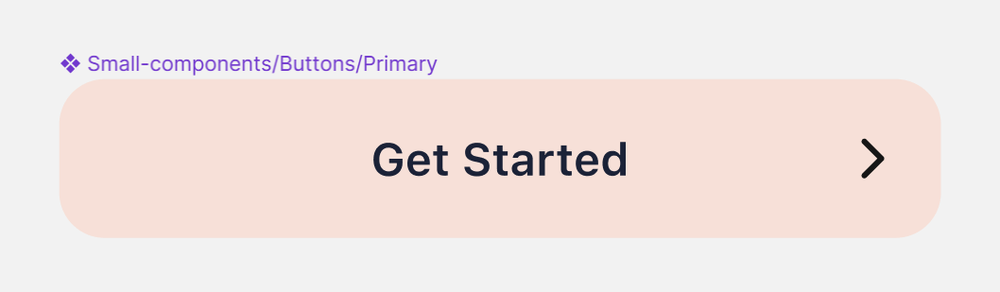
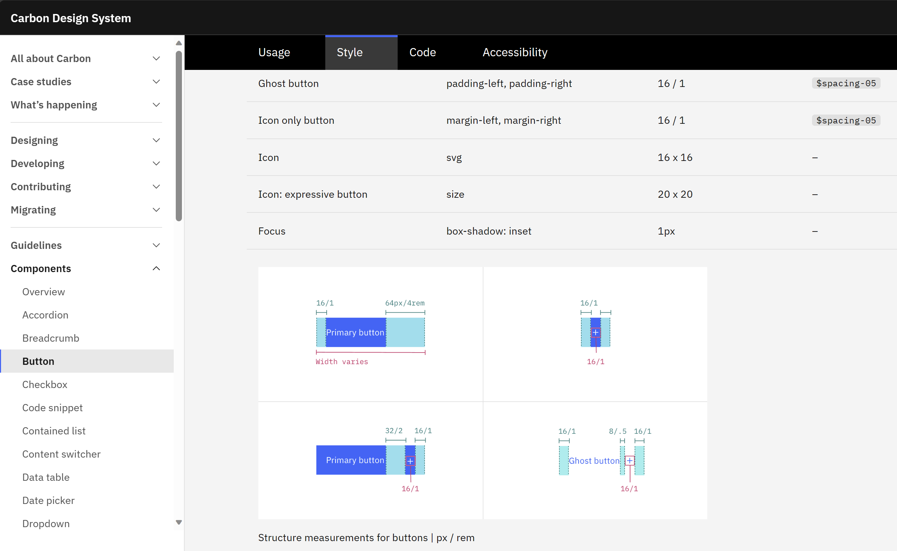
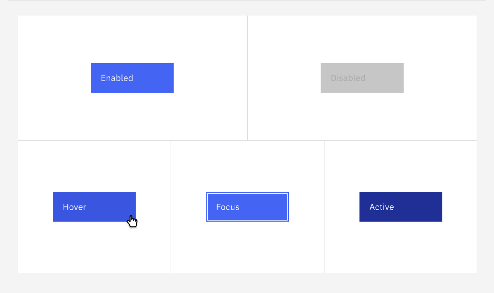

Trong nhiều năm làm nghề dev, mình thường nhảy qua lại giữa các loại dự án khác nhau.

Từ side projects của mình, đến dự án cho startup và công ty nhỏ, và cả các dự án cho enterprise (doanh nghiệp lớn).

Điểm chung của tất cả các loại dự án này đó là: dù tổ chức lớn hay nhỏ thì mọi cái ứng dụng đều cần có... một cái button.

Tất nhiên là còn cần nhiều thành phần UI khác mới thành một cái ứng dụng được.

Mình đem button ra làm ví dụ vì đây là một loại UI rất nhỏ, nhưng hóa ra xung quanh nó cũng lắm chuyện để nói, thành ra nó trở thành một mục tiêu rất hay cho câu chuyện này.

Vậy nên hôm nay mình sẽ kể cho bạn nghe về việc làm một cái button trong ứng dụng cho enterprise khác biệt như thế nào so với việc làm cho một tổ chức nhỏ
và chúng ta có thể học được gì thông qua việc làm một cái button.

## 1. Enterprise Yêu Cầu Mức Độ Chi Tiết Cao Hơn.

Có một điều mình nhận thấy, đó là ở một tổ chức nhỏ hoặc dự án nhỏ, hầu như người ta ít có đủ nguồn lực để đầu tư vào việc thiết kế UI/UX một cách hệ thống.

Nói vậy không phải bảo là UI của họ đơn giản. Các dự án mình làm qua đều có UI rất đẹp và phức tạp. Nhưng chỉ có một, hai designer làm UI thôi, họ hầu như chỉ đủ thời gian để vẽ các màn hình ở trạng thái tĩnh.

Ví dụ, những cái button trong design của họ thường chỉ có một trạng thái. Còn những trạng thái khác như `hover`, `active`, `disable`, `focus` thì không có.



Còn ở enterprise, họ có một team design lớn. Ở một dự án mình làm qua, họ thậm chí còn có một designer chuyên làm các animation cho các thành phần UI.

Họ cũng thường có một design system (một bộ quy tắc thiết kế) của riêng mình để đảm bảo rằng tất cả các thành phần UI trong ứng dụng đều nhất quán.

Một số design system được công chúng biết đến rộng rãi như Material Design của Google, hoặc Ant Design của Alibaba, Carbon Design của IBM, Fluent của Microsoft. Nhưng đó chỉ là một phần nhỏ, hầu hết các công ty lớn đều có design system của riêng mình và không công bố ra ngoài.

Vì vậy, khi mô tả UI cho một cái button, họ có cả vài trang tài liệu để mô tả chi tiết từng trạng thái của button, từ màu sắc, kích thước, padding, margin, đến animation, và cả các loại button khác nhau cho từng mục đích sử dụng khác nhau. Các thông số, màu sắc cũng phải tuân theo một hệ thống tên riêng của design system chứ không phải là một giá trị bất kỳ.



Tóm lại, việc làm một cái button ở enterprise cần phải tuân theo rất nhiều yêu cầu chi tiết hơn so với việc làm ở một tổ chức nhỏ.

Tất nhiên, ở nhiều công ty lớn, họ có một team nhỏ chuyên code thư viện các thành phần UI cơ bản tuân theo design system và cung cấp cho các team khác sử dụng.

Nhưng nhiều trường hợp, các team vẫn phải tự code một số thành phần vì số lượng UI là quá lớn và liên tục thay đổi. Ví dụ, ngay cả Material Design của Google cũng có một số thành phần không có sẵn trong thư viện Flutter của họ, mặc dù có cả một cộng đồng open source đang contribute vào đó.

Bản thân mình cũng từng làm một số thành phần UI cho một dự án enterprise, và mình nhận thấy rằng việc làm một cái button cũng không hề đơn giản chút nào. Vì sau khi code, team QA còn kiểm tra rất kĩ xem nó có tuân theo design system không, nên bắt buộc mình phải làm kĩ lưỡng chứ không thể bỏ qua thành phần nhỏ nào được.

## 2. Phải Đảm Bảo Rằng Code Dễ Sử Dụng Lại và Bảo Trì.

Ở một tổ chức nhỏ, code mình viết ra thường chỉ dành cho một dự án cụ thể, sang dự án khác là UI khác hẳn rồi.

Số lượng developer dùng lại code của mình cũng rất ít vì team khá nhỏ. Cần customize gì thì cứ sửa code cũng không ảnh hưởng tới ai quá nhiều. Anh em chỉ cần thông báo cho nhau là được.

Nhưng ở enterprise, vì tuân theo design system, nên các dự án khác nhau vẫn dùng cùng một kiểu UI giống nhau.

Số lượng developer sử dụng lại code của mình vì thế cũng rất lớn. Việc sửa code rõ ràng phải cẩn thận hơn vì nó ảnh hưởng tới rất nhiều người. Việc truyền đạt thông tin cho tất cả mọi người không đơn giản chút nào.

Vì vậy, ngay cả làm một cái button ở enterprise thôi, cũng phải đảm bảo rằng nó dễ tái sử dụng và bảo trì.

Do đó, việc làm một cái button ở enterprise cũng không chỉ là việc code mà còn là việc thiết kế API cho nó, viết tài liệu cho nó, và cả việc đảm bảo rằng code của nó dễ hiểu và dễ sửa sau này.

## 3. Áp Dụng Patterns Đã Được Biết Đến Rộng Rãi và Ví Dụ về `MaterialStateProperty` của Flutter.

Cách chuẩn nhất để code dễ hiểu, dễ bảo trì chính là áp dụng các patterns được biến đến rộng rãi trong ngành.

Pattern là một cách giải quyết vấn đề cho một vấn đề thông dụng, đã được nhiều người đúc kết và chứng minh là hiệu quả.

Nôm na là, nếu bạn code theo cách nổi tiếng, thì khả năng cao là người khác đã từng đọc qua cách đó rồi, hoặc ít nhất họ sẽ dễ dàng tìm kiếm thông tin về cách làm đó, dẫn đến họ có thể dễ dàng hiểu và sửa code của bạn.

Mình có một trường hợp cụ thể như này để các bạn dễ hình dung. Đó là khi mình cần làm button theo Carbon Design của IBM trong một dự án Flutter.

Nhiều bạn biết rằng, trong Flutter đã có sẵn nhiều button tuân theo Material Design hoặc Cupertino Design (cho iOS).

Nhưng Carbon Design thì không có và thư viện sẵn về Carbon cũng không được maintain tốt. Hơn nữa, cấu trúc của button trong Carbon khác nhiều so với hai loại design kia, nên việc chỉnh sửa một vài thuộc tính của button sẵn có để giống Carbon là không khả thi.

Vậy nên nhiệm vụ của mình là phải code một button từ đầu và phải đáp ứng tất cả các yêu cầu trong tài liệu của Carbon Design.

Tua nhanh qua các yêu cầu khác, chúng ta hãy tập trung vào một yêu cầu cụ thể mà mình đã nêu ra ban đầu: button cần phải đổi màu nền khi ở các trạng thái khác nhau như hover, active, disable, focus.



Trong lập trình web, chúng ta có `:hover`, `:active`, `:disabled`, `:focus` trong CSS để làm việc này rất đơn giản. Còn trong Flutter, câu chuyện hơi phức tạp hơn một chút.

### a. Nếu sử dụng `FilledButton` từ Material Design kết hợp với `FilledButton.styleFrom()`:

Thông thường chúng ta sẽ sử dụng `FilledButton` từ thư viện Material Design của Flutter, và sử dụng `FilledButton.styleFrom()` để tùy chỉnh giao diện cho nút này.

Hàm `styleFrom()` cho phép chúng ta tạo nhanh một `ButtonStyle` object với một phần nhỏ các thuộc tính có thể tùy chỉnh.

```dart
class LoginPage extends StatelessWidget {
  const LoginPage({super.key});

  @override
  Widget build(BuildContext context) {
    return FilledButton(
      style: FilledButton.styleFrom(
        backgroundColor: Colors.blue,
        disabledBackgroundColor: Colors.blue.shade100,
      ),
      onPressed: () {},
      child: const Text('Login'),
    );
  }
}
```

Tuy nhiên, rõ ràng `FilledButton.styleFrom()` chỉ cho phép chúng ta tùy chỉnh màu nền cho vài trạng thái, cụ thể ở đây là trạng thái thông thường và trạng thái disable. Còn các trạng thái khác như hover, active, focus thì không có. Rõ ràng là không đáp ứng được yêu cầu của Carbon Design.

### b. Sử dụng `ButtonStyle` và `MaterialStateProperty`:

Vẫn là `FilledButton`, nhưng lần này chúng ta tạo ra một `ButtonStyle` object đầy đủ. Nhờ đó, chúng ta có thể tùy chỉnh được tất cả thuộc tính, chấp nhận việc phải code dài hơn.

Để định nghĩa màu nền cho các trạng thái khác nhau, chúng ta tạo ra một `MaterialStateProperty` object và gán cho thuộc tính `backgroundColor` của `ButtonStyle`.

Lưu ý rằng trong code mình sử dụng `MaterialStateColor`, đó là một implementation của `MaterialStateProperty` cho đối tượng cụ thể ở đây là `Color`, nó giúp code của chúng ta ngắn hơn một chút.

```dart
class LoginPage extends StatelessWidget {
  const LoginPage({super.key});

  @override
  Widget build(BuildContext context) {
    return FilledButton(
      style: ButtonStyle(
        backgroundColor: MaterialStateColor.resolveWith(
          (states) {
            if (states.contains(MaterialState.disabled)) {
              return Colors.blue.shade100;
            }
            if (states.contains(MaterialState.pressed)) {
              return Colors.blue.shade200;
            }
            if (states.contains(MaterialState.hovered)) {
              return Colors.blue.shade300;
            }
            if (states.contains(MaterialState.focused)) {
              return Colors.blue.shade400;
            }
            return Colors.blue;
          },
        ),
      ),
      onPressed: () {},
      child: const Text('Login'),
    );
  }
}
```

Chúng ta có thể thấy rằng, tất cả các trạng thái như hover, active, disable, focus đều được định nghĩa rõ ràng là sẽ sử dụng màu gì. Điều này đáp ứng yêu cầu của chúng ta.

Chỉ có một vấn đề duy nhất: nếu chúng ta không được sử dụng `FilledButton` thì sao?

Vì như đã nói, mình cần code một button từ đầu để đảm bảo rằng nó đáp ứng đúng các yêu cầu khác của Carbon Design.

Vậy phải làm thế nào?

### c. Tận dụng cơ chế `MaterialStateProperty`:

Tất nhiên, để làm một button từ đầu, mình phải sử dụng các widget cơ bản để tạo hình dạng cho button như `Container`, `Text`, sử dụng `MouseRegion` để lắng nghe sự kiện `hover`, sử dụng `Focus` để lắng nghe sự kiện `focus`, và sử dụng `GestureDetector` để lắng nghe sự kiện `press`.

```dart
class BaseButton extends StatefulWidget {
  const BaseButton({super.key});

  @override
  State<BaseButton> createState() => _BaseButtonState();
}

class _BaseButtonState extends State<BaseButton> {
  @override
  Widget build(BuildContext context) {
    return Focus(
      onFocusChange: (_) {},
      child: MouseRegion(
        onEnter: (_) {},
        onExit: (_) {},
        child: GestureDetector(
          onTapUp: (_) {},
          onTapDown: (_) {},
          onTapCancel: () {},
        ),
      ),
    );
  }
}
```

Tới đây, có rất nhiều cách định nghĩa trạng thái cho button để lưu trong `_BaseButtonState`. Vậy mình nên tự nghĩ hết các phương án và chọn ra một cách, hay là mình nên làm như thế nào?

Như đã nói ở trên, đối với một vấn đề thông thường như thế này, chúng ta nên áp dụng pattern được biết đến rộng rãi.

Trong Flutter, đó chính là `MaterialStateProperty`, một cơ chế cho phép chúng ta định nghĩa giá trị cho một thuộc tính dựa trên các trạng thái được định nghĩa trong `MaterialState`.

Bản thân Flutter đang sử dụng cách này, chúng ta không cần phải _reinvent the wheel_. Bất cứ Flutter developer (ở một level nhất định) khi đọc code của chúng ta, họ sẽ hiểu ngay cách làm này.

Vậy Flutter sử dụng `MaterialStateProperty` như thế nào?

Đầu tiên, nó lưu một `Set<MaterialState>` object trong State của widget.

```dart {linenos=false,hl_lines=[9]}
class BaseButton extends StatefulWidget {
  const BaseButton({super.key});

  @override
  State<BaseButton> createState() => _BaseButtonState();
}

class _BaseButtonState extends State<BaseButton> {
  final Set<MaterialState> _states = {};

  @override
  Widget build(BuildContext context) {
    return Focus(
      onFocusChange: (_) {},
      child: MouseRegion(
        onEnter: (_) {},
        onExit: (_) {},
        child: GestureDetector(
          onTapUp: (_) {},
          onTapDown: (_) {},
          onTapCancel: () {},
        ),
      ),
    );
  }
}
```

Tiếp theo, nó cho phép chúng ta tạo ra một `MaterialStateProperty` object, trong đó chúng ta định nghĩa một hàm nhận vào một `Set<MaterialState>` object và trả về giá trị cho thuộc tính tương ứng với trạng thái đó.

```dart {linenos=false,hl_lines=["11-27"]}
class BaseButton extends StatefulWidget {
  const BaseButton({super.key});

  @override
  State<BaseButton> createState() => _BaseButtonState();
}

class _BaseButtonState extends State<BaseButton> {
  final Set<MaterialState> _states = {};

  final backgroundColorProp = MaterialStateProperty.resolveWith(
    (states) {
      if (states.contains(MaterialState.disabled)) {
        return Colors.blue.shade100;
      }
      if (states.contains(MaterialState.pressed)) {
        return Colors.blue.shade200;
      }
      if (states.contains(MaterialState.hovered)) {
        return Colors.blue.shade300;
      }
      if (states.contains(MaterialState.focused)) {
        return Colors.blue.shade400;
      }
      return Colors.blue;
    },
  );

  @override
  Widget build(BuildContext context) {
    return Focus(
      onFocusChange: (_) {},
      child: MouseRegion(
        onEnter: (_) {},
        onExit: (_) {},
        child: GestureDetector(
          onTapUp: (_) {},
          onTapDown: (_) {},
          onTapCancel: () {},
        ),
      ),
    );
  }
}
```

Khi có một sự kiện xảy ra, nó sẽ thêm hoặc bớt một giá trị trạng thái vào `Set<MaterialState>` object lưu trong State và gọi `setState()` để cập nhật lại giao diện.

Ví dụ, khi chuột tiến vào button, nó sẽ thêm `MaterialState.hovered` vào `Set<MaterialState>` object để đánh dấu trạng thái `hover`, và khi chuột rời khỏi button, nó sẽ bớt `MaterialState.hovered` ra khỏi `Set<MaterialState>` object để đánh dấu trạng thái không còn `hover` nữa.

```dart {linenos=false,hl_lines=["34-43"]}
class BaseButton extends StatefulWidget {
  const BaseButton({super.key});

  @override
  State<BaseButton> createState() => _BaseButtonState();
}

class _BaseButtonState extends State<BaseButton> {
  final Set<MaterialState> _states = {};

  final backgroundColorProp = MaterialStateProperty.resolveWith(
    (states) {
      if (states.contains(MaterialState.disabled)) {
        return Colors.blue.shade100;
      }
      if (states.contains(MaterialState.pressed)) {
        return Colors.blue.shade200;
      }
      if (states.contains(MaterialState.hovered)) {
        return Colors.blue.shade300;
      }
      if (states.contains(MaterialState.focused)) {
        return Colors.blue.shade400;
      }
      return Colors.blue;
    },
  );

  @override
  Widget build(BuildContext context) {
    return Focus(
      onFocusChange: (_) {},
      child: MouseRegion(
        onEnter: (_) {
          setState(() {
            _states.add(MaterialState.hovered);
          });
        },
        onExit: (_) {
          setState(() {
            _states.remove(MaterialState.hovered);
          });
        },
        child: GestureDetector(
          onTapUp: (_) {},
          onTapDown: (_) {},
          onTapCancel: () {},
        ),
      ),
    );
  }
}
```

Lúc này, trong hàm `build()`, chúng ta sẽ tính ra giá trị thực cho thuộc tính `backgroundColor` của button dựa trên `Set<MaterialState>` object và hàm chuyển đổi lưu trong `MaterialStateProperty` object.

```dart {linenos=false,hl_lines=[31,"50-53"]}
class BaseButton extends StatefulWidget {
  const BaseButton({super.key});

  @override
  State<BaseButton> createState() => _BaseButtonState();
}

class _BaseButtonState extends State<BaseButton> {
  final Set<MaterialState> _states = {};

  final backgroundColorProp = MaterialStateProperty.resolveWith(
    (states) {
      if (states.contains(MaterialState.disabled)) {
        return Colors.blue.shade100;
      }
      if (states.contains(MaterialState.pressed)) {
        return Colors.blue.shade200;
      }
      if (states.contains(MaterialState.hovered)) {
        return Colors.blue.shade300;
      }
      if (states.contains(MaterialState.focused)) {
        return Colors.blue.shade400;
      }
      return Colors.blue;
    },
  );

  @override
  Widget build(BuildContext context) {
    final backgroundColor = backgroundColorProp.resolve(_states);

    return Focus(
      onFocusChange: (_) {},
      child: MouseRegion(
        onEnter: (_) {
          setState(() {
            _states.add(MaterialState.hovered);
          });
        },
        onExit: (_) {
          setState(() {
            _states.remove(MaterialState.hovered);
          });
        },
        child: GestureDetector(
          onTapUp: (_) {},
          onTapDown: (_) {},
          onTapCancel: () {},
          child: Container(
            color: backgroundColor,
            child: const Text('Login'),
          ),
        ),
      ),
    );
  }
}
```

Như vậy, chúng ta đã hoàn thành việc định nghĩa màu nền cho button dựa trên các trạng thái khác nhau bằng cách tận dụng toàn bộ cơ chế `MaterialStateProperty` của Flutter.

## 4. Kết luận

Rõ ràng, làm một cái button trong ứng dụng cho enterprise, mà cụ thể hơn là làm một cái button theo design system của họ, không hề đơn giản chút nào. Lượng kiến thức mà chúng ta học được từ việc làm một cái button cũng cực kì quý giá.

Cụ thể, học được cách thiết kế code xung quanh `MaterialStateProperty` của Flutter, chúng ta sẽ mở rộng thêm kĩ năng về OOP (hướng đối tượng) và cách áp dụng nó trong thực tế. Sau này, khi gặp tình huống khác, chúng ta cũng có thêm một hướng suy nghĩ rất chất lượng.
